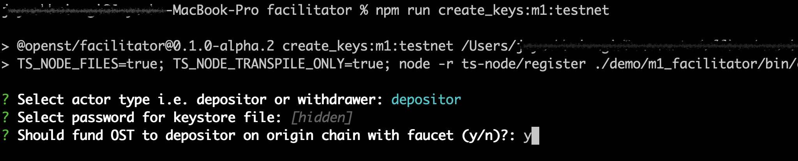
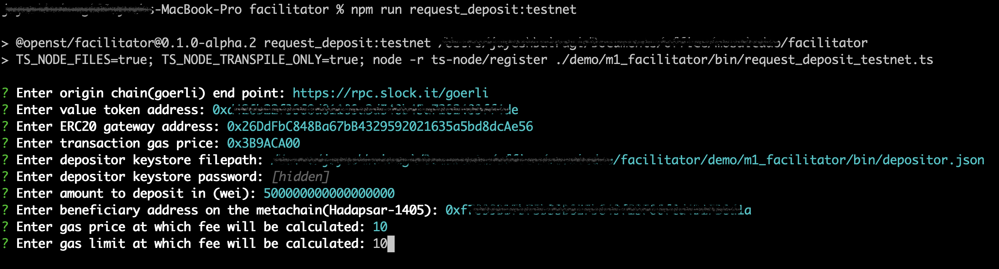
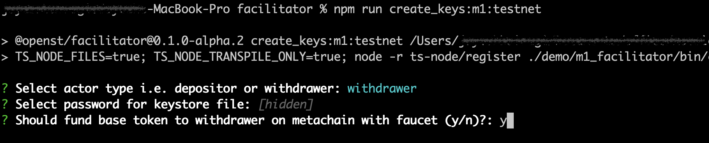
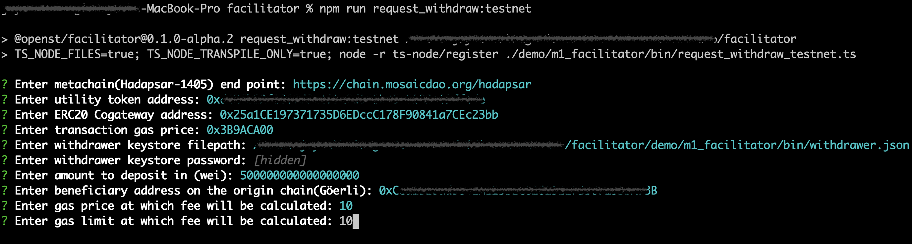

# Basic scripts for moving ERC20 tokens(like OST) from Göerli testnet into Hadapsar testnet 1405 (and out)
The following scripts will help you in moving the ERC20 tokens(like OST) from the origin chain(Göerli) to the mosaic metachain(Hadapsar-1405) where you can get the equivalent amount of ERC20 tokens (utility tokens).

## Prerequisites
1. Web3 RPC for the origin chain (Göerli)
  - If you want to use public göerli node<br>
    **RPC:** `https://rpc.slock.it/goerli`
  - You can run a Göerli full node by installing [mosaic chains](https://github.com/mosaicdao/mosaic-chains) npm package (in your dev dependencies):
    ```sh
    npm i @openst/mosaic-chains --save-dev
    ```
    and run
    ```sh
    ./node-modules/.bin/mosaic start goerli -g
    ```
    Once the chain is synced use the RPC url for deposit requests
2. Web3 RPC for the metachain (Hadapsar)
  - If you want to use the public hadapsar node<br>
  **RPC:** `https://chain.mosaicdao.org/hadapsar`
3. Clone facilitator repository
  ```sh
  git clone https://github.com/mosaicdao/facilitator
  ```
4. Install dependencies
  ```sh
  cd facilitator
  npm ci
  ```

## Steps to create depositor and initiate deposit request
Make sure that the prerequisites are met
1. Create depositor
  - Run the below script to create depositor account
  ```sh
  npm run create_keys:m1:testnet
  ```
  - Enter `depositor` when asked `Select actor type i.e. depositor or withdrawer:`
  - Next, enter the password to the keystore file
  - Next, enter `y` if you want to fund OST to depositor on the origin chain or `n` if not

  

2. Initiate deposit request
  - The depositor account must have sufficient GöEth and Value token balance to perform the approve and deposit transaction<br>
    Get the GöEth for the deposit transaction using [Faucet](https://goerli-faucet.slock.it/)
  - Run the below script to initiate deposit request
  ```sh
  npm run request_deposit:testnet
  ```
  Example request,

  

## Steps to create withdrawer and initiate withdraw request
Make sure that the prerequisites are met
1. Create withdrawer
  - Run the below script to create withdrawer account
  ```sh
  npm run create_keys:m1:testnet
  ```
  - Enter `withdrawer` when asked `Select actor type i.e. depositor or withdrawer:`
  - Next, enter the password to the keystore file
  - Next, enter `y` if you want to fund base token to the withdrawer on the metachain or `n` if not

  
2. Initiate withdraw request
  - The withdrawer account must have sufficient base token and utility token balance to perform the approve and deposit transaction<br>
  - Run the below script to initiate withdraw request
  ```sh
  npm run request_withdraw:testnet
  ```
  Example request,

  
